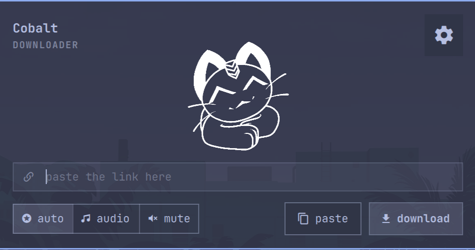
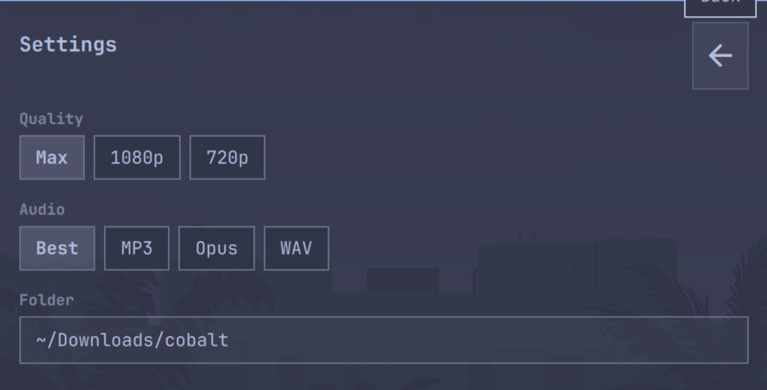

<p align="center">
  
</p>

# Cobalt Download

Paste a link, save the file. An unofficial [Omarchy](https://omarchy.org) bar panel.

Not [cobalt.tools](https://cobalt.tools). Not affiliated with [imput](https://github.com/imputnet/cobalt).

<p align="center">
  
</p>

## Install

```sh
omarchy pkg add yt-dlp ffmpeg
omarchy plugin add https://github.com/CloudDown/omarchy-cobalt.git --enable
```

**Install `yt-dlp` and `ffmpeg` yourself.** The plugin does not do it. A full Omarchy install often already has them; if YouTube (or the fallback) fails, run the first line.

Also needed: `python3`, `wl-paste`, `xdg-open` (stock Omarchy).

## Use

Click the bar icon → **paste** a URL → **auto** / **audio** / **mute** → **download**.

Cobalt API first, then **yt-dlp** if the instance cannot fetch the link. Gear = quality, audio format, folder.

```sh
omarchy bar move clouddown.cobalt --section right
omarchy-shell shell toggle clouddown.cobalt
```

## Remove

```sh
omarchy plugin remove clouddown.cobalt
```

Keeps `~/.config/omarchy/cobalt.json`.

## License

MIT. You are responsible for what you download.
